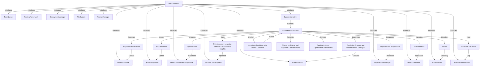

```mermaid
graph TD;
    A[Main Function] -->|Initializes| B[OllamaInterface]
    A -->|Initializes| C[KnowledgeBase]
    A -->|Initializes| D[ReinforcementLearningModule]
    A -->|Initializes| E[TaskQueue]
    A -->|Initializes| F[VersionControlSystem]
    A -->|Initializes| G[CodeAnalysis]
    A -->|Initializes| H[TestingFramework]
    A -->|Initializes| I[DeploymentManager]
    A -->|Initializes| J[ImprovementManager]
    A -->|Initializes| K[SelfImprovement]
    A -->|Initializes| L[FileSystem]
    A -->|Initializes| M[PromptManager]
    A -->|Initializes| N[ErrorHandler]
    A -->|Initializes| O[SpreadsheetManager]
    A -->|Initializes| P[SystemNarrative]
    P -->|Controls| Q[Improvement Process]
    Q -->|Analyzes| R[System State]
    Q -->|Generates| S[Improvement Suggestions]
    Q -->|Validates| T[Improvements]
    Q -->|Applies| U[Improvements]
    Q -->|Logs| V[State and Decisions]
    Q -->|Handles| W[Errors]
    Q -->|Assesses| X[Alignment Implications]
    Q -->|Uses| Y[Reinforcement Learning Feedback and Ollama Insights]
    Q -->|Integrates| Z[Predictive Analysis and Ollama-Driven Strategies]
    Q -->|Evolves| AA[Long-term Evolution with Ollama Guidance]
    R -->|Feedback| D
    S -->|Validation| J
    T -->|Application| K
    U -->|Update| C
    V -->|Log| O
    W -->|Recovery| N
    X -->|Consult| B
    Y -->|Optimize| F
    Z -->|Enhance| G
    AA -->|Refine| Q
    Q -->|Consults| AB[Ollama for Ethical and Alignment Considerations]
    Q -->|Refines| AC[Feedback Loop Optimization with Ollama]
```
